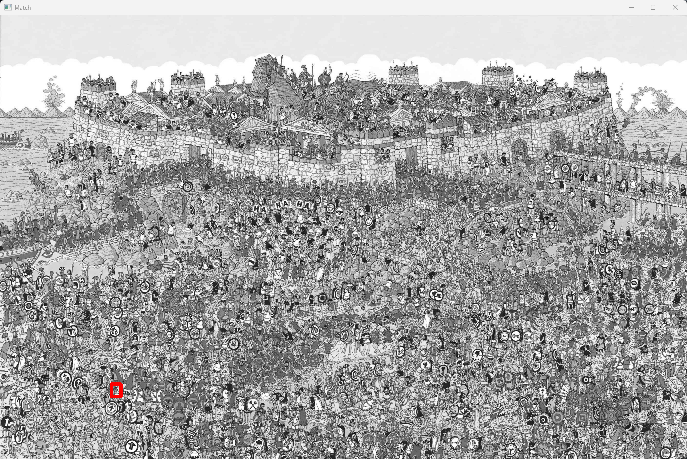

# WaldoFinder
Using OpenCv to Find Waldo in photos


## What package/library did you select
For Exploration Activity 1 I chose to look into basic computer vision. When researching online I came across OpenCV for python. I read over the documentation and came up for the idea of a where is waldo finder.


## Which package/library does the sample program demonstrate?


## What is the package/library?

### What purpose does it serve?


### How do you use it?

## What are the functionalities of the package/library?

## When was it created?

## Why did you select this package/library?

I chose OpenCV due to my growing instrest in computer vision. Im currently in school for a Software engineering degree and at the end of every engineers degree they must complete a year long capstone project. With my capstone I know its earily but i have acouple of ideas for projects that I could do, and I saw this as a oppertunity to get a better understanding of how machine /computer vision work to help me grow in this sepictic area of instrest.  

## How did learning the package/library influence your learning of the language?

With python I know there is millions of diffrent librarys and tons of cool stuff you can build. From this learning exercise I learned that with the help of external packages/librarys you can do some complex projects in under a 100 lines of code. 

This Section of code alone runs the photos to look for the desired object, runs it through all the vision methods and returns where waldo is and cirlces him with a red rectangle so its easier for the user. Without using librarys this code would be no where near as close and simple as OpenCv has made it.

```

methods = [cv2.TM_CCOEFF, cv2.TM_CCOEFF_NORMED, cv2.TM_CCORR_NORMED, cv2.TM_SQDIFF, cv2.TM_SQDIFF_NORMED]

    #the one method that works perfectly
    #methods = [cv2.TM_CCOEFF_NORMED]
    for curr in methods:
        img2 = img.copy()
        
        #provides us with a convolution(takes our template and slides it across our img and tries to make it)
        result = cv2.matchTemplate(img2, template, curr)
        
        
        # gets the size needed to compare 
        # e.g. 
        # if the image is 4x4 and the template is 2x2 this will get the avg 3x3 and that will slide in 3x3 to get max coverage on the img
        min_val, max_val, min_loc, max_loc = cv2.minMaxLoc(result)
        # prints all the possible locations
        #print(min_loc, max_loc)
        
        # using these methods cause they get the smallest size
        if(curr in [cv2.TM_SQDIFF, cv2.TM_SQDIFF_NORMED]):
            location = min_loc
        else:
            location = max_loc
            
        # putting a rectangle around the found item
        
        bottom_right = (location[0] + w, location[1] + h )
        cv2.rectangle(img2, location, bottom_right, (0, 0, 255), 5)
        cv2.imshow("Match", img2)
        cv2.waitKey(0)
        cv2.destroyAllWindows()

```
[OpenCV-Python Tutorials](https://vovkos.github.io/doxyrest-showcase/opencv/sphinx_rtd_theme/page_tutorial_py_root.html)


## How was your overall experience with the package/library?

This library is great the python community has tons of doctuments and examples online if you get stuck. OpenCv even has a OPenCv University with tons of videos and documents to help begineers or even adavcded programers to tons of different projects.

Going forward when reasuarching i did find acouple other project I would enjoy to build with OpenCV and would highly suggest anyone to look into there huge library. 

### When would you recommend this package/library to someone?
### Would you continue using this package/library? Why or why not?

## How does someone run your program?


## What purpose does your program serve?


## What would be some sample input/output?


# Sample Program Using OPENCV

## Introduction
This repository contains a sample program demonstrating the use of `OPENCV`, a [brief description of what the package/library does]. This program aims to showcase a few basic functionalities of `OPENCV` and serve a practical purpose [describe the practical purpose briefly].

## Getting Started


### Prerequisites
List any prerequisites for running your program, such as Python version, additional libraries, or setup requirements.

### Installation
#### OpenCV Python
Must have openCV downloaded
If not the command to run in your command promt is `pip install opencv-python`
### Running the Program
Explain how someone can run your program, including any command line arguments or input they need to provide.

## Program Purpose
Describe in detail what your program does, the problem it solves, and why it is useful.

## Sample Input/Output
Provide some examples of input your program expects and the output it generates.

- **Input**: [Sample input]
- **Output**: [Sample output]
### Waldo Easy Output


### Waldo Hard Output



## Images (Optional)
If applicable, include images that help demonstrate your program's functionality or output.

## Package/Library Overview

### Selection
- **Name**: [Package/Library Name]
- **Purpose**: Describe what the package/library is designed for and its main functionalities.
- **Usage**: How do you use it? Include basic setup instructions or initial setup code.

### Functionalities
Discuss the functionalities of the package/library, including code snippets and examples of output.

The following program is size dependant. Meaning that depending on the waldo test and your computer screen or monitor matters. The terminal will promt for which test to do, but if anyone would like to mess around with the values or there own photos these values worked the best.

#### test 1 (Use Waldo folder one)
    f1 = 0.7
    f2 = 0.7

#### test 2 (If using a monitor or any computer with an aspect ratio of 21:9 for hard waldo test)
    f1 = 0.5
    f2 = 1.2

#### test 3 (If using latop for hard waldo test)
    f1 = 0.3
    f2 = 0.7

### History
- **Creation Date**: January 28th, 2024
- **Reason for Selection**: I chose OpenCv due to my personal intrest into computer vison and learn more about how artificial intelligence works with programming languages like python

### Learning Experience
- **Influence on Learning**: How did learning this package/library influence your understanding of the programming language?
- **Overall Experience**: Share your overall experience with the package/library. Would you recommend it? Will you continue using it?

## References
Provide references for all the information and external resources you have used. Follow one of the specified referencing styles consistently throughout your document.

