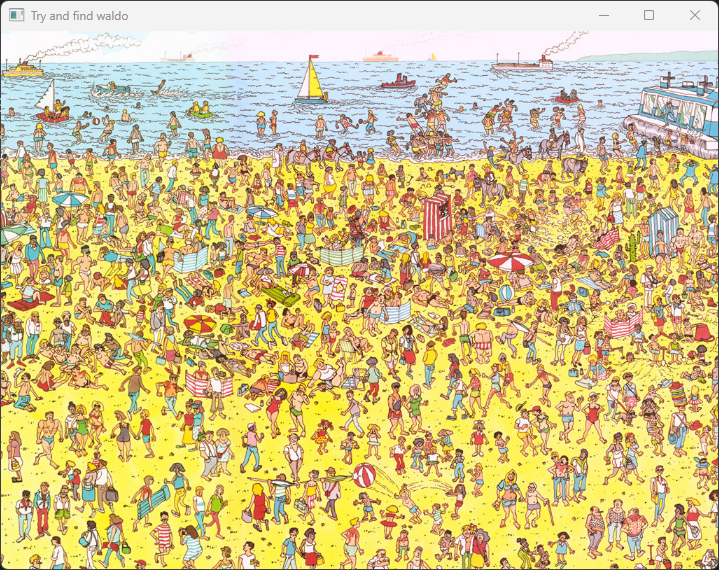

# WaldoFinder
Using OpenCv to Find Waldo in photos

- [WaldoFinder](#waldofinder)
  - [Which package/library does the sample program demonstrate?](#which-packagelibrary-does-the-sample-program-demonstrate)
  - [What purpose does your program serve](#what-purpose-does-your-program-serve)
  - [How does someone run your program? \& What would be some sample input/output?](#how-does-someone-run-your-program--what-would-be-some-sample-inputoutput)
      - [Easy Waldo Photo](#easy-waldo-photo)
      - [Hard Waldo Photo](#hard-waldo-photo)


## Which package/library does the sample program demonstrate?

OpenCV (Open-source computer vision library) is an open-source library for computer vision. OpenCV works with all sorts of programming languages like Python, Java, C++, and MatLab. 

## What purpose does your program serve

This prgram can be used as a learning experince to help people get more experence working with computer vision models. I have tested the program out with other situations like finding a specific car in a parking lot. This is a good start to a computer vision program if a user wanted to create something more advanced 

## How does someone run your program? & What would be some sample input/output?

There is acouple thinsg the user must have done before runnig the program.
If you dont have OpenCV for python downloaded you must:

1. Go to your terminal
2. (Windows/Mac/Linux) Run `pip install opencv-python`

Once complete the user can now run the program. One thing to keep in mind, I have preloaded the photo directory with github so if you move files through your desktop you will have to change the photo directory for the program.

There are three possible outputs a user can have with this program depending on the users input in the terminal

#### Easy Waldo Photo
```
Would you like to try the difficult waldo photo or the hard:
        e: Easy
        h: Hard
Input: e
```
After given `e` as an input the user will be promted with this photo. Current there is nothing on it the user can either try and find waldo on there own before OpenCV finds it or then can just exit out of the window right away. The user must exit out of the window to move on.



After exiting out of the photo window the user will be shown another window with waldo found and he will have a red rectangle surrounding waldo to help the user see where he is. Same as the window prior the user must close the window to move on.


#### Hard Waldo Photo

Notice there are two hard photo outputs. Due to OpenCV's algorthms, the size of the users screen is dependant to OpenCV image finder. So if the user is using a latop follow the output walkthrough 1. If the user is using a monitor for correct results they must use output walkthrough 2.

**Output walkthrough 1**

```
Would you like to try the difficult waldo photo or the hard:
        e: Easy
        h: Hard
Input: h
Are you on a laptop:
        y: Yes
        n: No
Input: y
```
After given `h` and `y` as an inputs the user will be promted with this photo. Current there is nothing on it the user can either try and find waldo on there own before OpenCV finds it or then can just exit out of the window right away. The user must exit out of the window to move on.


After exiting out of the photo window the user will be shown another window with waldo found and he will have a red rectangle surrounding waldo to help the user see where he is. Same as the window prior the user must close the window to move on.


**Output walkthrough 2**

```
Would you like to try the difficult waldo photo or the hard:
        e: Easy
        h: Hard
Input: h
Are you on a laptop:
        y: Yes
        n: No
Input: n
```
After given `h` and `n` as an inputs the user will be promted with this photo. Current there is nothing on it the user can either try and find waldo on there own before OpenCV finds it or then can just exit out of the window right away. The user must exit out of the window to move on.


After exiting out of the photo window the user will be shown another window with waldo found and he will have a red rectangle surrounding waldo to help the user see where he is. Same as the window prior the user must close the window to move on.


